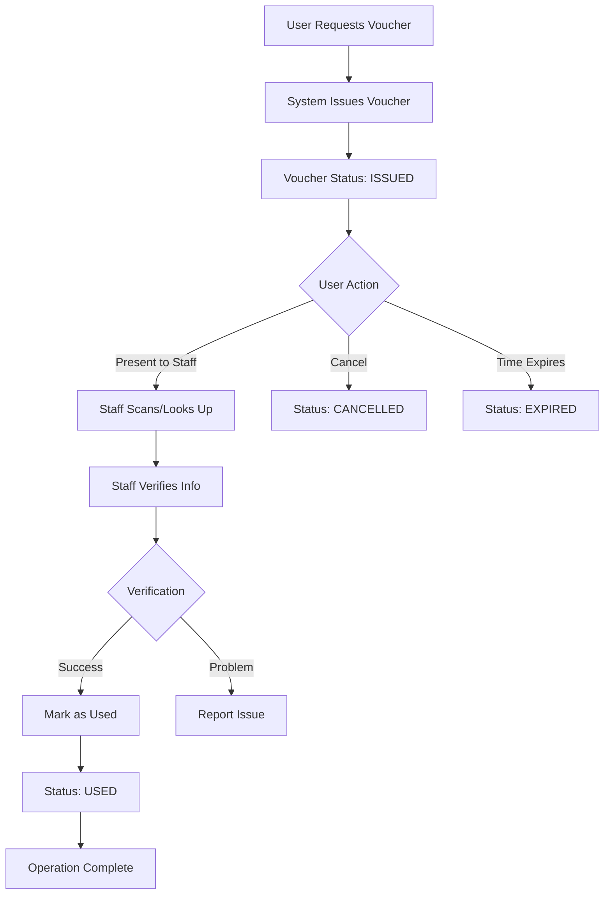

# YesLocker Electronic Voucher System Design

## 📋 System Overview

The electronic voucher system provides a secure, traceable mechanism for every store/retrieve operation at YesLocker facilities. Each operation requires a new voucher that contains user identification information for manual verification by staff.

## 🎯 Key Requirements

1. **One Voucher Per Operation**: Each store or retrieve action requires a new voucher
2. **Manual Verification**: Staff manually verifies user information, no automatic validation
3. **Complete Information Display**: Each voucher shows:
   - QR Code (contains voucher ID)
   - User Avatar Photo
   - Phone Number
   - Timestamp
   - Operation Type (Store/Retrieve)
4. **Full Traceability**: Track all voucher generations and uses

## 🗄️ Database Schema

### Vouchers Table
```sql
CREATE TABLE vouchers (
  id UUID PRIMARY KEY DEFAULT uuid_generate_v4(),
  user_id UUID NOT NULL REFERENCES users(id),
  locker_id UUID NOT NULL REFERENCES lockers(id),
  operation_type VARCHAR(20) NOT NULL CHECK (operation_type IN ('store', 'retrieve')),
  code VARCHAR(8) UNIQUE NOT NULL,
  qr_data JSONB NOT NULL,
  status VARCHAR(20) NOT NULL DEFAULT 'issued' CHECK (status IN ('issued', 'used', 'expired', 'cancelled')),
  
  -- Snapshot user info at issue time
  user_phone VARCHAR(20) NOT NULL,
  user_name VARCHAR(100) NOT NULL,
  user_avatar_url TEXT,
  
  -- Timestamps
  issued_at TIMESTAMP WITH TIME ZONE DEFAULT NOW(),
  expires_at TIMESTAMP WITH TIME ZONE NOT NULL,
  used_at TIMESTAMP WITH TIME ZONE,
  cancelled_at TIMESTAMP WITH TIME ZONE,
  
  -- Verification info
  used_by UUID REFERENCES admins(id),
  used_at_store UUID REFERENCES stores(id),
  verification_notes TEXT,
  
  -- Metadata
  device_info JSONB,
  created_at TIMESTAMP WITH TIME ZONE DEFAULT NOW(),
  updated_at TIMESTAMP WITH TIME ZONE DEFAULT NOW()
);

-- Indexes for performance
CREATE INDEX idx_vouchers_user_id ON vouchers(user_id);
CREATE INDEX idx_vouchers_code ON vouchers(code);
CREATE INDEX idx_vouchers_status ON vouchers(status);
CREATE INDEX idx_vouchers_issued_at ON vouchers(issued_at);
CREATE INDEX idx_vouchers_expires_at ON vouchers(expires_at);
```

### Voucher Events Table (Audit Log)
```sql
CREATE TABLE voucher_events (
  id UUID PRIMARY KEY DEFAULT uuid_generate_v4(),
  voucher_id UUID NOT NULL REFERENCES vouchers(id),
  event_type VARCHAR(50) NOT NULL,
  actor_type VARCHAR(20) NOT NULL CHECK (actor_type IN ('user', 'staff', 'system')),
  actor_id UUID,
  store_id UUID REFERENCES stores(id),
  metadata JSONB,
  created_at TIMESTAMP WITH TIME ZONE DEFAULT NOW()
);

CREATE INDEX idx_voucher_events_voucher_id ON voucher_events(voucher_id);
CREATE INDEX idx_voucher_events_created_at ON voucher_events(created_at);
```

## 🔌 API Endpoints

### User-Side Endpoints

#### 1. Request New Voucher
```
POST /vouchers/request
Body: {
  "locker_id": "uuid",
  "operation_type": "store" | "retrieve"
}
Response: {
  "voucher": {
    "id": "uuid",
    "code": "ABC12345",
    "qr_data": "base64_encoded_qr_image",
    "operation_type": "store",
    "user_info": {
      "name": "张三",
      "phone": "139****0025",
      "avatar_url": "https://..."
    },
    "locker_info": {
      "number": "A-001",
      "store_name": "呈贡店"
    },
    "issued_at": "2024-01-19T10:30:00Z",
    "expires_at": "2024-01-19T11:00:00Z",
    "status": "issued"
  }
}
```

#### 2. Get My Voucher History
```
GET /vouchers/my-history?status=used&operation_type=store&from=2024-01-01&to=2024-01-19
Response: {
  "vouchers": [...],
  "total": 25,
  "page": 1
}
```

#### 3. Get Voucher Details
```
GET /vouchers/:id
Response: {
  "voucher": { ... }
}
```

#### 4. Cancel Voucher
```
POST /vouchers/:id/cancel
Response: {
  "success": true,
  "message": "凭证已取消"
}
```

### Admin/Staff-Side Endpoints

#### 1. Scan/Lookup Voucher
```
GET /api/admin/vouchers/scan/:code
Response: {
  "voucher": {
    "id": "uuid",
    "code": "ABC12345",
    "operation_type": "store",
    "status": "issued",
    "user": {
      "id": "uuid",
      "name": "张三",
      "phone": "13900000025",
      "avatar_url": "https://..."
    },
    "locker": {
      "number": "A-001",
      "store_name": "呈贡店"
    },
    "issued_at": "2024-01-19T10:30:00Z",
    "expires_at": "2024-01-19T11:00:00Z",
    "is_expired": false,
    "time_remaining": "25 minutes"
  }
}
```

#### 2. Verify and Mark as Used
```
POST /api/admin/vouchers/:id/verify
Body: {
  "verification_notes": "用户身份已确认"
}
Response: {
  "success": true,
  "message": "凭证已验证使用"
}
```

#### 3. List All Vouchers
```
GET /api/admin/vouchers?status=issued&store_id=uuid&from=2024-01-19
Response: {
  "vouchers": [...],
  "total": 150,
  "stats": {
    "issued_today": 45,
    "used_today": 38,
    "expired_today": 5,
    "cancelled_today": 2
  }
}
```

#### 4. Voucher Statistics
```
GET /api/admin/vouchers/stats
Response: {
  "daily_stats": {
    "total_issued": 145,
    "total_used": 130,
    "total_expired": 10,
    "total_cancelled": 5,
    "average_use_time": "8.5 minutes",
    "peak_hour": "14:00-15:00"
  },
  "by_operation": {
    "store": 85,
    "retrieve": 60
  },
  "by_store": [...]
}
```

## 🖥️ Frontend Implementation

### User Interface Changes

#### User App - Request Voucher Page
```vue
<template>
  <div class="voucher-request">
    <h2>申请操作凭证</h2>
    <div class="operation-selector">
      <button @click="requestVoucher('store')" class="store-btn">
        📥 存放台球杆
      </button>
      <button @click="requestVoucher('retrieve')" class="retrieve-btn">
        📤 取出台球杆
      </button>
    </div>
  </div>
</template>
```

#### User App - Voucher Display
```vue
<template>
  <div class="voucher-display">
    <div class="voucher-card">
      <div class="qr-section">
        
        <div class="code">{{ voucher.code }}</div>
      </div>
      
      <div class="user-info">
        
        <div class="details">
          <div class="name">{{ voucher.user_info.name }}</div>
          <div class="phone">{{ voucher.user_info.phone }}</div>
        </div>
      </div>
      
      <div class="operation-info">
        <div class="operation-type" :class="voucher.operation_type">
          {{ voucher.operation_type === 'store' ? '存放' : '取出' }}
        </div>
        <div class="locker">
          杆柜：{{ voucher.locker_info.number }}
        </div>
        <div class="store">
          门店：{{ voucher.locker_info.store_name }}
        </div>
      </div>
      
      <div class="time-info">
        <div class="issued">申请时间：{{ formatTime(voucher.issued_at) }}</div>
        <div class="expires">有效期至：{{ formatTime(voucher.expires_at) }}</div>
        <div class="countdown" v-if="voucher.status === 'issued'">
          剩余时间：{{ timeRemaining }}
        </div>
      </div>
      
      <div class="status-badge" :class="voucher.status">
        {{ statusText }}
      </div>
    </div>
  </div>
</template>
```

#### Admin App - Voucher Verification Page
```vue
<template>
  <div class="voucher-verification">
    <div class="scan-section">
      <qr-scanner @scan="onScanCode" />
      <input v-model="manualCode" placeholder="或手动输入凭证码" />
      <button @click="lookupVoucher">查询</button>
    </div>
    
    <div v-if="voucher" class="verification-display">
      <div class="user-verification">
        
        <div class="user-details">
          <h3>{{ voucher.user.name }}</h3>
          <div class="phone">{{ voucher.user.phone }}</div>
        </div>
      </div>
      
      <div class="operation-details">
        <div class="operation-type" :class="voucher.operation_type">
          操作类型：{{ voucher.operation_type === 'store' ? '存放' : '取出' }}
        </div>
        <div class="locker">杆柜编号：{{ voucher.locker.number }}</div>
        <div class="time">申请时间：{{ voucher.issued_at }}</div>
        <div class="validity" :class="{ expired: voucher.is_expired }">
          {{ voucher.is_expired ? '已过期' : `剩余 ${voucher.time_remaining}` }}
        </div>
      </div>
      
      <div class="verification-actions">
        <button @click="verifyVoucher" class="verify-btn" :disabled="voucher.status !== 'issued'">
          ✅ 确认验证
        </button>
        <button @click="reportIssue" class="report-btn">
          ⚠️ 报告问题
        </button>
      </div>
      
      <textarea v-model="notes" placeholder="验证备注（可选）"></textarea>
    </div>
  </div>
</template>
```

## 🔄 Voucher Lifecycle



## ⚙️ Implementation Steps

### Phase 1: Database Setup
1. Create vouchers and voucher_events tables
2. Add indexes for performance
3. Create stored procedures for voucher expiry

### Phase 2: Backend Implementation
1. Implement voucher generation endpoint with QR code creation
2. Add voucher lookup and verification endpoints
3. Create background job for auto-expiry
4. Implement audit logging for all voucher events

### Phase 3: User Frontend
1. Update action-vue.vue to request new voucher each time
2. Create voucher display component with all info
3. Add voucher history page
4. Implement countdown timer for expiry

### Phase 4: Admin Frontend
1. Create voucher scanning/lookup page
2. Build verification interface with large avatar display
3. Add voucher management dashboard
4. Implement statistics and reporting views

### Phase 5: Testing & Optimization
1. Test complete flow: request → verify → use
2. Optimize QR code generation performance
3. Add caching for frequently accessed vouchers
4. Implement rate limiting for voucher requests

## 🔒 Security Considerations

1. **QR Code Security**: Use signed tokens or UUIDs, not direct data encoding
2. **Rate Limiting**: Max 5 active vouchers per user
3. **Expiry Policy**: 30-minute default, configurable per store
4. **Audit Trail**: Log all voucher events with actor information
5. **Data Snapshot**: Store user info at issue time to prevent tampering
6. **Staff Authentication**: Require staff login for verification actions

## 📊 Monitoring & Analytics

1. **Key Metrics**:
   - Voucher issue rate
   - Average time to use
   - Expiry rate
   - Cancellation rate
   - Peak usage hours

2. **Alerts**:
   - High expiry rate (>20%)
   - Unusual cancellation patterns
   - Rapid reissue attempts (potential fraud)
   - Staff verification anomalies

## 🚀 Migration Strategy

Since this is a new design replacing the concept of "one voucher per user":

1. **Database Migration**: Create new vouchers table structure
2. **API Versioning**: Implement new endpoints alongside existing ones
3. **Frontend Toggle**: Use feature flag to switch between old and new system
4. **Staff Training**: Provide documentation and training for new verification process
5. **Gradual Rollout**: Start with one store, then expand