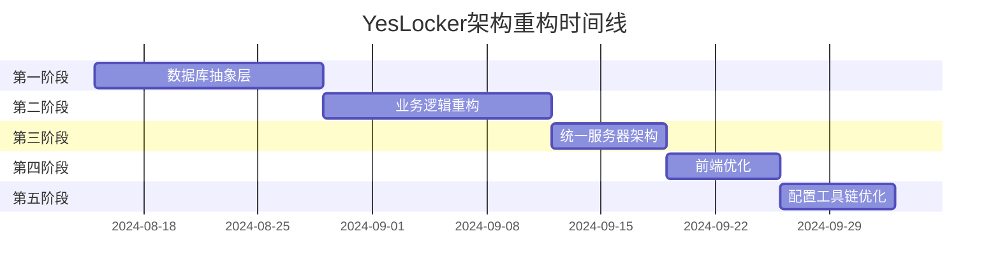

# 🏗️ YesLocker 架构重构详细实施方案

## 📋 概览

### 🎯 重构目标
- **统一后端架构**: 消除5个重复服务器文件，建立单一、可维护的服务器架构
- **数据库抽象层**: 实现SQLite/PostgreSQL无缝切换，提高数据库操作一致性  
- **分层架构**: 建立清晰的Controller→Service→Repository→Model分层
- **代码复用**: 提取前端共享组件，减少重复代码
- **配置统一**: 简化多环境配置管理

### 🚨 当前架构问题
1. **后端混乱**: 5个重复服务器文件(index.js, index-railway.js, express-server.js等)
2. **代码重复率**: 估计70%以上的业务逻辑重复实现
3. **数据库耦合**: 每个服务器文件都直接操作数据库，缺乏抽象层
4. **维护困难**: 修复一个bug需要在多个文件中重复操作

## 🎨 技术架构设计

### 后端分层架构
```
┌─────────────────────────────────────────┐
│                 Routes                  │  ← HTTP路由层
├─────────────────────────────────────────┤
│              Controllers                │  ← 控制器层 (请求处理)
├─────────────────────────────────────────┤  
│               Services                  │  ← 业务逻辑层
├─────────────────────────────────────────┤
│             Repositories                │  ← 数据访问层
├─────────────────────────────────────────┤
│          Models (Objection.js)          │  ← 数据模型层
├─────────────────────────────────────────┤
│        Database (SQLite/PostgreSQL)     │  ← 数据库层
└─────────────────────────────────────────┘
```

### 技术选型

#### 数据库抽象层
- **ORM**: Objection.js (基于Knex.js)
- **优势**: 强类型支持、关系管理、查询构建器、多数据库支持
- **模式**: Repository Pattern + Model.bindKnex()

#### 分层架构组件
```typescript
// Models (数据模型)
class User extends Model {
  static tableName = 'users';
  static relationMappings = { ... };
}

// Repositories (数据访问)
class UserRepository {
  async findById(id: string): Promise<User | null> { ... }
  async create(userData: CreateUserDTO): Promise<User> { ... }
}

// Services (业务逻辑)
class UserService {
  constructor(private userRepo: UserRepository) {}
  async registerUser(data: RegisterDTO): Promise<RegisterResult> { ... }
}

// Controllers (请求处理)
class UserController {
  constructor(private userService: UserService) {}
  async register(req: Request, res: Response): Promise<void> { ... }
}
```

## 📅 分阶段实施计划

### 🟢 第一阶段：数据库抽象层 (第1-2周)

#### 目标
- 创建统一的数据库抽象层
- 实现多数据库支持 (SQLite/PostgreSQL)
- 定义所有业务实体的Model

#### 具体任务
1. **安装和配置Objection.js**
   ```bash
   npm install objection knex
   # 配置knex支持SQLite和PostgreSQL
   ```

2. **创建数据库配置系统**
   ```typescript
   // server/src/config/database.ts
   export const getDatabaseConfig = () => {
     const env = process.env.NODE_ENV;
     if (env === 'production') {
       return {
         client: 'postgresql',
         connection: process.env.DATABASE_URL
       };
     }
     return {
       client: 'sqlite3',
       connection: { filename: './database/yeslocker.db' }
     };
   };
   ```

3. **定义所有Model类**
   ```typescript
   // server/src/models/
   ├── User.ts          # 用户模型
   ├── Admin.ts         # 管理员模型  
   ├── Store.ts         # 门店模型
   ├── Locker.ts        # 杆柜模型
   ├── Application.ts   # 申请模型
   └── LockerRecord.ts  # 使用记录模型
   ```

4. **创建Repository层**
   ```typescript
   // server/src/repositories/
   ├── UserRepository.ts
   ├── AdminRepository.ts
   ├── StoreRepository.ts
   ├── LockerRepository.ts
   ├── ApplicationRepository.ts
   └── LockerRecordRepository.ts
   ```

#### 验收标准
- [ ] 所有Model类定义完成并通过类型检查
- [ ] Repository层可以在SQLite和PostgreSQL间无缝切换
- [ ] 现有数据库测试脚本全部通过
- [ ] 不影响现有API功能

### 🟡 第二阶段：业务逻辑重构 (第3-4周)

#### 目标
- 提取和统一重复的业务逻辑
- 创建Service层处理业务规则
- 重构Controller层为薄层

#### 具体任务
1. **创建Service层**
   ```typescript
   // server/src/services/
   ├── AuthService.ts        # 认证服务
   ├── UserService.ts        # 用户服务
   ├── AdminService.ts       # 管理服务
   ├── LockerService.ts      # 杆柜服务
   └── ApplicationService.ts # 申请服务
   ```

2. **重构现有路由到Controller层**
   ```typescript
   // server/src/controllers/
   ├── AuthController.ts
   ├── UserController.ts
   ├── AdminController.ts
   └── LockerController.ts
   ```

3. **实现依赖注入容器**
   ```typescript
   // server/src/container.ts
   export class DIContainer {
     private static instance: DIContainer;
     
     getUserService(): UserService {
       return new UserService(
         this.getUserRepository(),
         this.getAuthService()
       );
     }
   }
   ```

4. **逐步迁移index-railway.js的路由**
   - 保持原API兼容性
   - 逐个路由迁移并测试
   - 确保生产环境稳定性

#### 验收标准
- [ ] 所有业务逻辑移动到Service层
- [ ] Controller层变为薄层，只处理HTTP请求/响应
- [ ] 单元测试覆盖率达到80%以上
- [ ] 生产环境API响应时间不变或更快

### 🔵 第三阶段：统一服务器架构 (第5周)

#### 目标
- 创建统一的服务器入口
- 清理冗余的服务器文件
- 完善中间件系统

#### 具体任务
1. **创建统一服务器**
   ```typescript
   // server/src/app.ts
   export class YesLockerApp {
     private app: Express;
     private database: Knex;
     
     async initialize() {
       await this.connectDatabase();
       this.setupMiddleware();
       this.setupRoutes();
       this.setupErrorHandling();
     }
   }
   ```

2. **统一中间件系统**
   ```typescript
   // server/src/middleware/
   ├── auth.ts              # JWT认证
   ├── validation.ts        # 请求验证
   ├── errorHandler.ts      # 错误处理
   ├── logging.ts           # 请求日志
   └── rateLimit.ts         # 限流
   ```

3. **创建新的生产入口**
   ```typescript
   // server/src/index.ts (新的生产入口)
   import { YesLockerApp } from './app';
   
   const app = new YesLockerApp();
   app.start();
   ```

4. **向后兼容性保证**
   - 保持index-railway.js可用(作为fallback)
   - 渐进式切换到新架构
   - 完整的回滚策略

#### 验收标准
- [ ] 新架构完全替代旧服务器文件功能
- [ ] 所有API端点正常工作
- [ ] 性能指标不低于原架构
- [ ] 完整的监控和日志系统

### 🟠 第四阶段：前端优化 (第6周)

#### 目标
- 提取用户端和管理端的共享组件
- 统一API服务层
- 优化状态管理

#### 具体任务
1. **创建共享组件库**
   ```typescript
   // shared/components/
   ├── ui/
   │   ├── Button.vue
   │   ├── Input.vue
   │   ├── Modal.vue
   │   └── Table.vue
   ├── business/
   │   ├── UserCard.vue
   │   ├── LockerCard.vue
   │   └── ApplicationCard.vue
   └── layout/
       ├── Header.vue
       └── Footer.vue
   ```

2. **统一API服务层**
   ```typescript
   // shared/services/
   ├── api/
   │   ├── base.ts          # 基础API客户端
   │   ├── auth.ts          # 认证API
   │   ├── user.ts          # 用户API
   │   └── admin.ts         # 管理API
   └── types/
       ├── user.ts          # 用户类型定义
       ├── admin.ts         # 管理类型定义
       └── api.ts           # API响应类型
   ```

3. **优化状态管理**
   ```typescript
   // shared/stores/
   ├── auth.ts              # 认证状态
   ├── user.ts              # 用户状态
   └── admin.ts             # 管理状态
   ```

#### 验收标准
- [ ] 代码重复率从70%降低到30%以下
- [ ] 共享组件在两个前端应用中正常工作
- [ ] 类型安全性提升，编译时错误减少
- [ ] 构建时间减少20%以上

### 🟣 第五阶段：配置和工具链优化 (第7周)

#### 目标
- 统一环境配置管理
- 优化开发工具链
- 完善自动化测试

#### 具体任务
1. **统一配置管理**
   ```typescript
   // config/
   ├── development.json     # 开发环境配置
   ├── production.json      # 生产环境配置
   └── test.json           # 测试环境配置
   ```

2. **改进构建脚本**
   ```json
   {
     "scripts": {
       "dev": "concurrently \"npm run dev:server\" \"npm run dev:client\" \"npm run dev:admin\"",
       "build": "npm run build:server && npm run build:client && npm run build:admin",
       "test": "npm run test:unit && npm run test:integration",
       "deploy": "npm run test && npm run build && npm run deploy:railway"
     }
   }
   ```

3. **完善测试系统**
   ```
   tests/
   ├── unit/                # 单元测试
   ├── integration/         # 集成测试
   ├── e2e/                # 端到端测试
   └── performance/         # 性能测试
   ```

#### 验收标准
- [ ] 单一环境变量文件控制所有配置
- [ ] 自动化测试覆盖率达到85%以上
- [ ] CI/CD流程完全自动化
- [ ] 开发体验显著提升

## 🛡️ 风险评估与缓解策略

### 高风险项目
1. **数据库迁移风险**
   - **风险**: 数据模型改变可能导致数据丢失
   - **缓解**: 完整备份 + 逐步迁移 + 回滚脚本

2. **生产环境中断风险**
   - **风险**: 重构过程中可能影响线上服务
   - **缓解**: 蓝绿部署 + 金丝雀发布 + 实时监控

3. **API兼容性风险**
   - **风险**: 新架构可能破坏现有API契约
   - **缓解**: 版本控制 + 兼容性测试 + 渐进式迁移

### 回滚策略
```bash
# 每个阶段完成后的回滚点
git tag refactor-phase-1-complete
git tag refactor-phase-2-complete
git tag refactor-phase-3-complete

# 紧急回滚命令
git checkout refactor-phase-2-complete
npm run deploy:rollback
```

### 监控指标
- **性能指标**: API响应时间、数据库查询时间、内存使用
- **稳定性指标**: 错误率、可用性、成功请求率
- **业务指标**: 用户注册数、申请提交数、管理员操作数

## 📊 成功标准

### 技术指标
- [ ] 代码重复率从70%降低到30%以下
- [ ] API响应时间维持或改善(目标<1000ms)
- [ ] 单元测试覆盖率达到85%以上
- [ ] 生产部署时间从30分钟减少到10分钟

### 开发体验指标
- [ ] 新功能开发时间减少40%
- [ ] Bug修复时间减少50% 
- [ ] 新开发者上手时间从3天减少到1天
- [ ] 代码审查时间减少30%

### 业务指标
- [ ] 系统可用性保持99.9%以上
- [ ] 用户申请成功率维持在95%以上
- [ ] 管理员操作效率提升20%
- [ ] 数据库查询性能提升30%

## 📅 详细时间线



## 🎯 里程碑检查点

### 里程碑1 (第2周末)
- [ ] 数据库抽象层完成
- [ ] 所有Model和Repository测试通过
- [ ] 现有功能无影响

### 里程碑2 (第4周末)  
- [ ] Service层重构完成
- [ ] 业务逻辑统一
- [ ] API性能保持或提升

### 里程碑3 (第5周末)
- [ ] 统一服务器架构部署
- [ ] 冗余文件清理
- [ ] 生产环境稳定运行

### 里程碑4 (第6周末)
- [ ] 前端共享组件提取完成
- [ ] 代码重复率大幅降低
- [ ] 开发效率提升

### 里程碑5 (第7周末)
- [ ] 配置管理统一
- [ ] 自动化测试完善
- [ ] 重构项目完全交付

---

**方案制定时间**: 2024-08-14  
**预计完成时间**: 2024-10-02 (7周)  
**项目负责人**: Architecture Team  
**审批状态**: 待审批