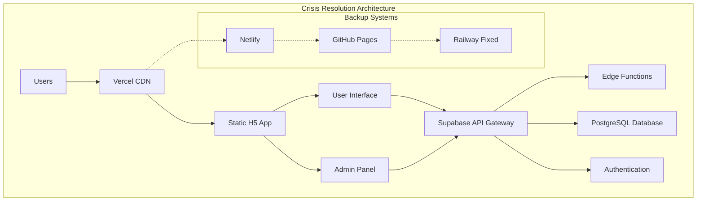

# Technical Design: YesLocker Crisis Resolution Architecture

## Emergency Recovery Strategy Overview

This design implements a multi-path crisis resolution with immediate fallback options and long-term stability measures.

## Architecture Decision: Static Deployment Approach

### Primary Strategy: Vercel Migration (IMMEDIATE)
**Decision**: Migrate from Railway to Vercel using existing static build system
**Rationale**: 
- Existing vercel.json configuration already present
- uni-app H5 builds are static by nature and perfect for Vercel
- Proven architecture (static frontend + Supabase backend)
- Immediate deployment capability

### Technical Implementation



## Component Design

### 1. Build System Architecture

```typescript
interface DeploymentPipeline {
  primary: {
    platform: 'vercel';
    buildCommand: 'npm run build:h5';
    outputDir: 'dist/';
    config: 'vercel.json';
  };
  fallback: {
    platform: 'netlify' | 'github-pages';
    buildCommand: 'npm run build:h5';
    outputDir: 'dist/';
  };
  emergency: {
    platform: 'railway-fixed';
    buildCommand: 'npm run build:h5';
    serverCommand: 'npm start';
  };
}
```

### 2. Static Asset Routing

```typescript
interface RoutingConfiguration {
  userApp: {
    source: '/';
    destination: '/index.html';
    fallback: 'index.html'; // SPA routing
  };
  adminPanel: {
    source: '/admin/*';
    destination: '/admin/index.html';
    fallback: 'admin/index.html';
  };
  apiProxy: {
    source: '/api/*';
    destination: 'https://supabase-project.supabase.co/functions/v1/*';
    headers: {
      'Cache-Control': 'no-cache';
    };
  };
}
```

### 3. Environment Configuration Matrix

| Platform | User App | Admin Panel | API Routing | Deploy Time |
|----------|----------|-------------|-------------|-------------|
| Vercel   | ✅ Static | ✅ Static   | ✅ Proxy    | ~2 minutes  |
| Netlify  | ✅ Static | ✅ Static   | ✅ Redirects| ~3 minutes  |
| GitHub   | ✅ Static | ❌ Complex  | ❌ External | ~5 minutes  |
| Railway  | 🔧 Fix    | 🔧 Fix      | ✅ Direct   | ~Unknown    |

### 4. Crisis Response Decision Tree


## Data Layer Architecture

### Supabase Integration (Unchanged)
```typescript
interface SupabaseConfiguration {
  url: string; // Existing production instance
  anonKey: string; // Public API access
  functions: {
    authLogin: '/auth-login';
    authRegister: '/auth-register';
    lockerOperations: '/locker-operations';
    adminApproval: '/admin-approval';
    // All existing functions remain operational
  };
}
```

### Database Schema (No Changes Required)
- All existing tables and relationships remain intact
- RLS policies continue to function
- Edge Functions remain deployed and operational
- No data migration required

## Implementation Priority Matrix

### Phase 1: Immediate Recovery (0-2 hours)
1. **Vercel Deployment** - Highest priority, fastest resolution
2. **Environment Variables Setup** - Critical for functionality
3. **DNS Configuration** - Required for public access
4. **Basic Functionality Verification** - Confirm core features work

### Phase 2: Stability Assurance (2-8 hours)
1. **Comprehensive Testing** - All user flows and admin functions
2. **Performance Optimization** - CDN caching and asset optimization
3. **Monitoring Setup** - Health checks and error tracking
4. **Backup Platform Setup** - Netlify as secondary option

### Phase 3: Long-term Resolution (8-24 hours)
1. **Railway Root Cause Analysis** - Parallel investigation
2. **CI/CD Pipeline Restoration** - Automated deployments
3. **Documentation Updates** - Crisis response procedures
4. **Post-incident Review** - Prevention measures

## Security Considerations

### Environment Variables Migration
```bash
# Vercel Environment Variables (Required)
SUPABASE_URL=https://[project-id].supabase.co
SUPABASE_ANON_KEY=eyJ... (existing key)
SUPABASE_SERVICE_ROLE_KEY=eyJ... (existing key)
TENCENT_SECRET_ID=AKI... (SMS service)
TENCENT_SECRET_KEY=... (SMS service)
TENCENT_SMS_APP_ID=... (SMS configuration)
TENCENT_SMS_SIGN_NAME=... (SMS signature)
```

### API Security (Maintained)
- All existing Supabase RLS policies remain active
- JWT authentication unchanged
- CORS configuration preserved
- Rate limiting via Supabase continues

## Performance Architecture

### CDN Strategy
```typescript
interface CDNConfiguration {
  staticAssets: {
    cacheControl: 'public, max-age=31536000, immutable';
    compression: 'gzip, brotli';
    formats: ['webp', 'avif'] // for images
  };
  dynamicContent: {
    cacheControl: 'public, max-age=86400';
    revalidation: 'stale-while-revalidate';
  };
  apiRequests: {
    cacheControl: 'no-cache';
    timeout: '30s';
  };
}
```

### Load Testing Requirements
- Concurrent user testing: 100+ simultaneous users
- API response time: <3 seconds for all endpoints
- Static asset delivery: <1 second from CDN
- Database query optimization via existing indexes

## Monitoring and Alerting

### Health Check Endpoints
```typescript
interface HealthChecks {
  frontend: {
    endpoint: '/';
    expectedStatus: 200;
    checkInterval: '1m';
  };
  api: {
    endpoint: '/api/health';
    expectedStatus: 200;
    checkInterval: '30s';
  };
  database: {
    endpoint: '/api/db-health';
    expectedStatus: 200;
    checkInterval: '2m';
  };
}
```

### Alert Thresholds
- Response time > 5 seconds: WARNING
- Error rate > 5%: CRITICAL  
- Uptime < 99%: CRITICAL
- Database connection failures: IMMEDIATE

## Rollback Strategy

### Emergency Rollback Procedure
1. **DNS Rollback**: Point domain to last known working deployment
2. **Database Rollback**: Revert to last stable migration if needed
3. **Configuration Rollback**: Restore previous environment variables
4. **Code Rollback**: Deploy previous working commit

### Rollback Decision Matrix
| Issue Type | Rollback Target | Recovery Time | Data Loss Risk |
|------------|----------------|---------------|----------------|
| Build Failure | Previous commit | ~5 minutes | None |
| Config Error | Previous env vars | ~2 minutes | None |
| DB Migration | Previous migration | ~10 minutes | Possible |
| Complete Failure | Full system restore | ~15 minutes | Possible |

This design ensures immediate crisis resolution with multiple fallback options while maintaining system integrity and preparing for long-term stability.