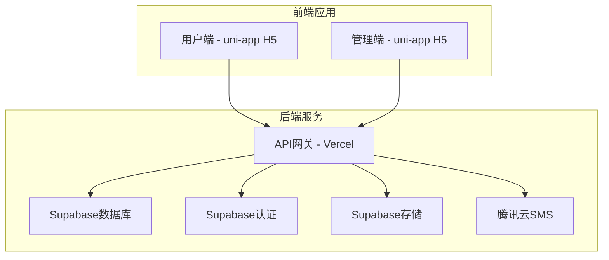

# 杆柜管理小程序 - 技术设计文档

## 系统架构

### 整体架构


### 技术栈详细说明

#### 前端技术栈
- **框架**：uni-app
- **语言**：JavaScript/TypeScript
- **UI框架**：uni-ui
- **状态管理**：Vuex
- **路由管理**：uni-app内置路由
- **HTTP客户端**：uni.request

#### 后端技术栈
- **数据库**：Supabase PostgreSQL
- **认证**：Supabase Auth
- **文件存储**：Supabase Storage
- **API**：Supabase REST API
- **实时订阅**：Supabase Realtime
- **部署**：Vercel Serverless Functions

#### 第三方服务
- **短信服务**：腾讯云SMS
- **二维码生成**：qrcode.js
- **图片处理**：Sharp.js

## 数据库设计

### 表结构设计

#### 1. 用户表 (users)
```sql
CREATE TABLE users (
    id UUID PRIMARY KEY DEFAULT gen_random_uuid(),
    phone VARCHAR(11) UNIQUE NOT NULL,
    name VARCHAR(50),
    avatar_url TEXT,
    status INTEGER DEFAULT 1, -- 1:正常 0:禁用
    created_at TIMESTAMP WITH TIME ZONE DEFAULT NOW(),
    updated_at TIMESTAMP WITH TIME ZONE DEFAULT NOW()
);
```

#### 2. 门店表 (stores)
```sql
CREATE TABLE stores (
    id UUID PRIMARY KEY DEFAULT gen_random_uuid(),
    name VARCHAR(100) NOT NULL,
    address TEXT,
    phone VARCHAR(20),
    manager_id UUID REFERENCES users(id),
    status INTEGER DEFAULT 1, -- 1:营业 0:暂停
    created_at TIMESTAMP WITH TIME ZONE DEFAULT NOW(),
    updated_at TIMESTAMP WITH TIME ZONE DEFAULT NOW()
);
```

#### 3. 杆柜表 (cabinets)
```sql
CREATE TABLE cabinets (
    id UUID PRIMARY KEY DEFAULT gen_random_uuid(),
    store_id UUID REFERENCES stores(id) NOT NULL,
    cabinet_number VARCHAR(20) NOT NULL,
    user_id UUID REFERENCES users(id),
    status INTEGER DEFAULT 0, -- 0:空闲 1:使用中 2:维修中 3:清理中
    assigned_at TIMESTAMP WITH TIME ZONE,
    created_at TIMESTAMP WITH TIME ZONE DEFAULT NOW(),
    updated_at TIMESTAMP WITH TIME ZONE DEFAULT NOW(),
    UNIQUE(store_id, cabinet_number)
);
```

#### 4. 申请记录表 (applications)
```sql
CREATE TABLE applications (
    id UUID PRIMARY KEY DEFAULT gen_random_uuid(),
    user_id UUID REFERENCES users(id) NOT NULL,
    store_id UUID REFERENCES stores(id) NOT NULL,
    cabinet_id UUID REFERENCES cabinets(id),
    status INTEGER DEFAULT 0, -- 0:待审核 1:已通过 2:已拒绝
    apply_reason TEXT,
    reject_reason TEXT,
    reviewed_by UUID REFERENCES users(id),
    reviewed_at TIMESTAMP WITH TIME ZONE,
    created_at TIMESTAMP WITH TIME ZONE DEFAULT NOW(),
    updated_at TIMESTAMP WITH TIME ZONE DEFAULT NOW()
);
```

#### 5. 存取记录表 (access_records)
```sql
CREATE TABLE access_records (
    id UUID PRIMARY KEY DEFAULT gen_random_uuid(),
    cabinet_id UUID REFERENCES cabinets(id) NOT NULL,
    user_id UUID REFERENCES users(id) NOT NULL,
    action INTEGER NOT NULL, -- 1:存入 2:取出
    operated_at TIMESTAMP WITH TIME ZONE DEFAULT NOW(),
    notes TEXT,
    created_at TIMESTAMP WITH TIME ZONE DEFAULT NOW()
);
```

#### 6. 管理员表 (admins)
```sql
CREATE TABLE admins (
    id UUID PRIMARY KEY DEFAULT gen_random_uuid(),
    user_id UUID REFERENCES users(id) NOT NULL,
    store_id UUID REFERENCES stores(id),
    role INTEGER DEFAULT 1, -- 1:门店管理员 2:系统管理员
    permissions JSONB,
    created_at TIMESTAMP WITH TIME ZONE DEFAULT NOW(),
    updated_at TIMESTAMP WITH TIME ZONE DEFAULT NOW()
);
```

#### 7. 提醒记录表 (reminder_logs)
```sql
CREATE TABLE reminder_logs (
    id UUID PRIMARY KEY DEFAULT gen_random_uuid(),
    type INTEGER NOT NULL, -- 1:长期未使用 2:申请待处理 3:系统通知
    target_id UUID, -- 目标ID（用户ID或申请ID等）
    message TEXT NOT NULL,
    status INTEGER DEFAULT 0, -- 0:待发送 1:已发送 2:发送失败
    sent_at TIMESTAMP WITH TIME ZONE,
    error_message TEXT,
    created_at TIMESTAMP WITH TIME ZONE DEFAULT NOW()
);
```

### 索引设计
```sql
-- 用户表索引
CREATE INDEX idx_users_phone ON users(phone);
CREATE INDEX idx_users_status ON users(status);

-- 杆柜表索引
CREATE INDEX idx_cabinets_store_id ON cabinets(store_id);
CREATE INDEX idx_cabinets_user_id ON cabinets(user_id);
CREATE INDEX idx_cabinets_status ON cabinets(status);

-- 申请记录表索引
CREATE INDEX idx_applications_user_id ON applications(user_id);
CREATE INDEX idx_applications_store_id ON applications(store_id);
CREATE INDEX idx_applications_status ON applications(status);

-- 存取记录表索引
CREATE INDEX idx_access_records_cabinet_id ON access_records(cabinet_id);
CREATE INDEX idx_access_records_user_id ON access_records(user_id);
CREATE INDEX idx_access_records_operated_at ON access_records(operated_at);
```

## API设计

### RESTful API规范

#### 基础URL
- 开发环境: `https://dev-golf-cabinet.vercel.app/api`
- 生产环境: `https://golf-cabinet.vercel.app/api`

#### 认证方式
- 使用JWT Token进行认证
- Header: `Authorization: Bearer <token>`

### API接口清单

#### 1. 用户认证相关
```
POST /auth/send-sms          # 发送短信验证码
POST /auth/verify-sms        # 验证短信验证码
POST /auth/login             # 用户登录
POST /auth/logout            # 用户登出
GET  /auth/profile           # 获取用户信息
PUT  /auth/profile           # 更新用户信息
```

#### 2. 杆柜申请相关
```
GET  /applications           # 获取申请列表
POST /applications           # 提交杆柜申请
GET  /applications/:id       # 获取申请详情
PUT  /applications/:id       # 更新申请状态
DELETE /applications/:id     # 取消申请
```

#### 3. 杆柜管理相关
```
GET  /cabinets               # 获取杆柜列表
GET  /cabinets/:id           # 获取杆柜详情
PUT  /cabinets/:id           # 更新杆柜状态
GET  /cabinets/:id/records   # 获取杆柜使用记录
```

#### 4. 存取操作相关
```
POST /access/store           # 记录存入操作
POST /access/retrieve        # 记录取出操作
GET  /access/records         # 获取个人存取记录
```

#### 5. 门店管理相关
```
GET  /stores                 # 获取门店列表
GET  /stores/:id             # 获取门店详情
GET  /stores/:id/cabinets    # 获取门店杆柜列表
GET  /stores/:id/statistics  # 获取门店统计数据
```

#### 6. 管理员功能相关
```
GET  /admin/applications     # 获取待审核申请
PUT  /admin/applications/:id # 审核申请
GET  /admin/users            # 获取用户列表
PUT  /admin/users/:id        # 管理用户状态
GET  /admin/statistics       # 获取统计数据
POST /admin/reminders        # 发送提醒
```

#### 7. 工具功能相关
```
POST /utils/qrcode           # 生成二维码
POST /utils/upload           # 文件上传
GET  /utils/verify-qrcode    # 验证二维码
```

## 前端架构设计

### 项目结构
```
src/
├── components/           # 公共组件
│   ├── common/          # 通用组件
│   ├── business/        # 业务组件
│   └── charts/          # 图表组件
├── pages/               # 页面
│   ├── user/           # 用户端页面
│   ├── admin/          # 管理端页面
│   └── common/         # 公共页面
├── store/              # 状态管理
│   ├── modules/        # 状态模块
│   └── index.js        # 入口文件
├── utils/              # 工具函数
│   ├── api.js          # API封装
│   ├── auth.js         # 认证工具
│   ├── storage.js      # 存储工具
│   └── common.js       # 通用工具
├── styles/             # 样式文件
│   ├── common.scss     # 公共样式
│   └── variables.scss  # 样式变量
└── static/             # 静态资源
    ├── images/         # 图片资源
    └── icons/          # 图标资源
```

### 状态管理设计

#### Vuex Store结构
```javascript
const store = new Vuex.Store({
  modules: {
    user: {
      state: {
        userInfo: null,
        isLogin: false,
        token: null
      },
      mutations: {
        SET_USER_INFO,
        SET_LOGIN_STATUS,
        SET_TOKEN
      },
      actions: {
        login,
        logout,
        getUserInfo
      }
    },
    cabinet: {
      state: {
        cabinets: [],
        currentCabinet: null,
        applications: []
      },
      mutations: {
        SET_CABINETS,
        SET_CURRENT_CABINET,
        SET_APPLICATIONS
      },
      actions: {
        getCabinets,
        applyCabinet,
        getApplications
      }
    },
    admin: {
      state: {
        pendingApplications: [],
        statistics: {}
      },
      mutations: {
        SET_PENDING_APPLICATIONS,
        SET_STATISTICS
      },
      actions: {
        getPendingApplications,
        reviewApplication,
        getStatistics
      }
    }
  }
})
```

### 路由设计

#### 用户端路由
```javascript
const userRoutes = [
  {
    path: '/user/home',
    name: 'UserHome',
    component: () => import('@/pages/user/home')
  },
  {
    path: '/user/apply',
    name: 'CabinetApply',
    component: () => import('@/pages/user/apply')
  },
  {
    path: '/user/cabinet',
    name: 'MyCabinet',
    component: () => import('@/pages/user/cabinet')
  },
  {
    path: '/user/records',
    name: 'AccessRecords',
    component: () => import('@/pages/user/records')
  },
  {
    path: '/user/profile',
    name: 'UserProfile',
    component: () => import('@/pages/user/profile')
  }
]
```

#### 管理端路由
```javascript
const adminRoutes = [
  {
    path: '/admin/dashboard',
    name: 'AdminDashboard',
    component: () => import('@/pages/admin/dashboard')
  },
  {
    path: '/admin/applications',
    name: 'ApplicationReview',
    component: () => import('@/pages/admin/applications')
  },
  {
    path: '/admin/cabinets',
    name: 'CabinetManagement',
    component: () => import('@/pages/admin/cabinets')
  },
  {
    path: '/admin/users',
    name: 'UserManagement',
    component: () => import('@/pages/admin/users')
  },
  {
    path: '/admin/statistics',
    name: 'Statistics',
    component: () => import('@/pages/admin/statistics')
  }
]
```

## 后端架构设计

### Serverless Functions结构
```
api/
├── auth/
│   ├── send-sms.js         # 发送短信验证码
│   ├── verify-sms.js       # 验证短信验证码
│   └── profile.js          # 用户资料管理
├── applications/
│   ├── index.js            # 申请CRUD操作
│   └── review.js           # 申请审核
├── cabinets/
│   ├── index.js            # 杆柜管理
│   └── records.js          # 使用记录
├── admin/
│   ├── dashboard.js        # 管理面板
│   ├── statistics.js       # 数据统计
│   └── users.js           # 用户管理
├── utils/
│   ├── qrcode.js          # 二维码生成
│   ├── upload.js          # 文件上传
│   └── sms.js             # 短信服务
└── middleware/
    ├── auth.js            # 认证中间件
    ├── validation.js      # 参数验证
    └── error.js           # 错误处理
```

### 数据库操作层
```javascript
// database/index.js
import { createClient } from '@supabase/supabase-js'

const supabase = createClient(
  process.env.SUPABASE_URL,
  process.env.SUPABASE_ANON_KEY
)

export class DatabaseService {
  // 用户相关操作
  async createUser(userData) { ... }
  async getUserByPhone(phone) { ... }
  async updateUser(id, userData) { ... }
  
  // 杆柜相关操作
  async getCabinets(storeId) { ... }
  async assignCabinet(cabinetId, userId) { ... }
  async updateCabinetStatus(id, status) { ... }
  
  // 申请相关操作
  async createApplication(applicationData) { ... }
  async getApplications(filters) { ... }
  async reviewApplication(id, reviewData) { ... }
  
  // 存取记录相关操作
  async createAccessRecord(recordData) { ... }
  async getAccessRecords(filters) { ... }
  
  // 统计相关操作
  async getCabinetUsageStats(storeId) { ... }
  async getUserStats() { ... }
}
```

## 安全设计

### 认证授权
- JWT Token有效期设置为7天
- 实现Token刷新机制
- 敏感操作需要验证身份
- 管理员权限分级控制

### 数据安全
- 所有数据传输使用HTTPS加密
- 敏感数据（如手机号）部分脱敏显示
- 实施SQL注入防护
- 实现XSS攻击防护

### 业务安全
- 短信验证码限制发送频率
- 登录失败次数限制
- 重要操作增加二次确认
- 审计日志记录所有关键操作

## 性能优化

### 前端优化
- 路由懒加载
- 图片懒加载
- 组件缓存
- API接口缓存
- 代码分割

### 后端优化
- 数据库查询优化
- 索引优化
- 缓存策略
- CDN加速
- 分页查询

### 缓存策略
- Redis缓存热点数据
- 浏览器缓存静态资源
- API响应缓存
- 数据库查询结果缓存

## 监控告警

### 性能监控
- API响应时间监控
- 错误率监控
- 用户访问量监控
- 资源使用率监控

### 业务监控
- 申请审核时效监控
- 杆柜使用率监控
- 用户活跃度监控
- 短信发送成功率监控

### 告警机制
- 系统异常告警
- 性能指标告警
- 业务指标告警
- 安全事件告警